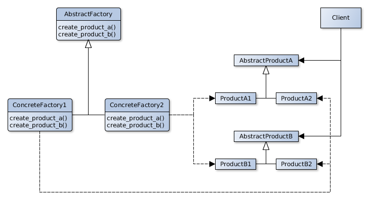

# Abstract Factory

## Scope
Provide ad interface for the creation of families of correlated or dependent objecs without specify the concrete classes.

## Participants
- **AbstractFactory** 
  - Declares an interface for the operations of creation of abstract product objects.
- **ConcreteFactory** 
  - Implements the creation of concrete product objects.
- **AbstractProduct** 
  - Declares an interface for a product object type.
- **ConcreteProduct** 
  - Defines a product object that will be created by the correspondent ConcreteFactory.
  - Implements the abstract produnct interfaces.
- **Client** 
  - Uses the interfaces of AbstractFactory and AbstractProduct.

## Collaborations
- Will be used one only instance od ConcreteFactory during the execution, this ConcreteFactory willmanage the creation of a specificy family of concrete products.
- The AbstractFactory delegates the creation of product object to his ConcreteFactories.

