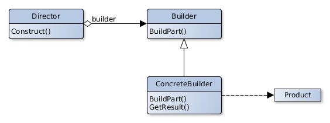

# Builder

## Scope

Divides the construction of a complex object from his representation, so that the construction process could be used to
create different representations.

## Participants

- **Builder**
    - Specifies an abstract interface for the creation of the parts of a product object .
- **ConcreteBuilder**
    - Builds and assemblies the product's parties through the implementation of the builder interface.
    - Defines and keeps track of Product representations.
    - Provides an interface to get the object who represents the result of the building procedure.
- **Director**
    - Builds an object using the Builder interface.
- **Product**
    - Represents the complex object under construction. ConcreteBuilder builds the product's internal representation and
      defines the process used for his assembly.
    - Knows the classes of the singles parties who belongs to the product and the interfaces to assembly this parties to
      obtain the final result.

## Collaborations

- The Client creates the Director's object and configures it to work with the Builder object wanted.
- The Director informs the builder every time a new product's part has to be built.
- The Builder receives and menages the requests from Director and adds parts to the Product.
- The clients retrieves from the Builder the completed Product.

