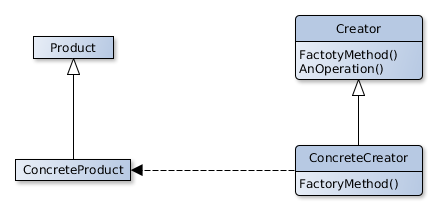

# Factory Method

## Scope
Defines an interface for the creation of an object, leaving the choose of the class to be instanziated to the subclasses.
This pattern defers the initialization os a class to the subclasses.

## Participants
- **Product**
   - Defines the interface of the objects created by the factory method.
- **ConcreteProduct**
   - Implements Product's interface.
- **Creator** 
   - Declares the factory method who returns a Product's type object.
   - Could have a standard implementation of the factory method for a ConcreteProduct.
- **ConcreteCreator** 
   - Overrides the factory method to return a ConcreteProduct's instance.

## Collaborations
- The Creator uses his subclasses to re-implement the factory method so that will be returned the correct ConcreteProduct's instance.

