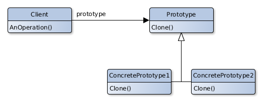

# Prototype

## Scope

Specify the typology of objects to build using a prototype instance and create new objects copying the prototype.

## Participants

- **Prototype**
    - Declares an interface to allow his cloning.
- **ConcretePrototype**
    - Implements the clone operation.
- **Client** .
    - Creates a new object by asking the Prototype to clone.

## Collaborations

- The Client asks the Prototype to clone himself.

