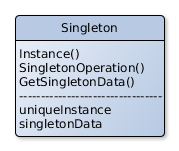

# Singleton

## Scope
Ensures that a class has a only one instance and provides a global access point to the structure.

## Participants
- **Singleton** 
   - Defines an operation Instance who makes able clients to access to the unique instance of the class.
   - Could be responsable for the creation of his instance.

## Collaborations
- Clients could access only to one instance of the singleton throw the Instance method.

