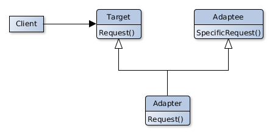
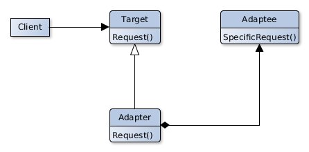

# Adapter

## Scope
Converts the interface of a class in a interface required by the cliens.
The Adapter permits to different classes to work together when thi s could not bi possible for the incompatible classes.

## Participants
- **Target**
   - Defines the domain's specific interface used by the Client.
- **Client**
   - Works with objects similar to Target.
- **Adaptee**
   - Has a specific interface who must be adaptet.
- **Adapter** 
   - Adapts the Adaptee's interface to the Target one.

## Collaborations
- The clients calls the operations on the Adapter.
- The Adapter calls the matching operations on the Adaptee.
