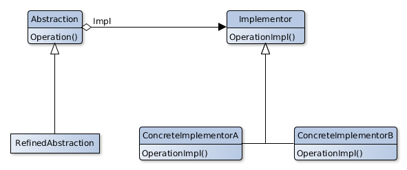

# Bridge

## Scope
Decouples an abstraction from his implementation so that they can evolve independently.

## Participants
- **Abstraction** 
   - Defines abstraction's interface.
   - Keeps a reference to a Implementor's object type.
- **RefinedAbstraction** 
   - Extends the interface defined by Abstraction.
- **Implementor**
   - Defines the interface for the classes who implement the abstraction. This interface could be completely different from the Abstraction.
   - This interface provides only the base operations, Abstraction defines the higher level operations who are based on the lower ones.
- **ConcreteImplementor**
   - Provides a concrete implementation to the Implementor's interface.

## Collaborations
- Abstraction delegates the requests of the client to his Implementor instance.

