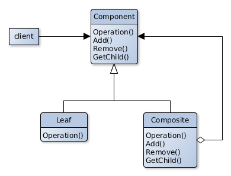

# Composite

## Scope
Composites objects into tree structures to represent hierarchies and use single objects or compositions at the same time.

## Participants
- **Component**
  - Declares the interface for the compositions' objects.
  - Implements the behavior common to all classes if needed.
  - Declares an interface for the access and management of his children.
  - Could declare a interface to access at the parent component of the structure.
- **Leaf** .
   - Represents the leaves of the composition: the objects that have no children.
   - Defines the behavior of the primitive objects of the composition.
- **Composite** .
  - Defines the behavior of the objects who have children.
  - Stores all his children.
   - Implements the operations for the access and management of his children.
- **Client** .
   - Manages the objects in the composition trough the implementation of the Component interface .

## Collaborations
- The Client uses the Component's interface to interact with the objects in the composition.
- If a request goes to a Leaf it will be manage immediately.
- Therefore, if the objects is a Composite, it will transferred to his children.
