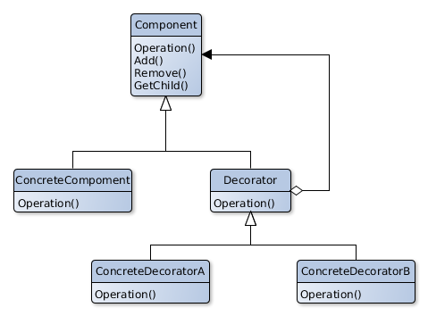

# Decorator

## Scope
Dynamically adds responsibilities to an object. Decorators give a flexible alternative to defining  of new subclasses as tool to create new features.

## Participants
- **Component**
   - Defines an interface common to the objects for which new features can be added.
- **ConcreteComponent**
   - Defines an object to which responsibilities can be added.
- **Decorator**
   - Keeps a reference to a Component and defines an interfaces for the new features.
- **ConcreteDecorator**
   - Adds responsibilities to the Component.

## Collaborations
- A Decorator transfers the requests to his Component.
- It can do some operations before and/or after the transfer of the request.
