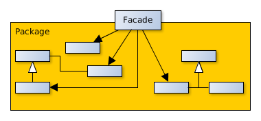

# Facade

## Scope
Provides a unified interface for a set of interfaces of a subsystem. Defines an upper level interface to make the subsystem more easy to use.

## Participants
- **Facade**
   - Knows the Subsystem Classes responsible for a request.
   - Delegate client's requests to the correct subsystem object.
- **SubsystemClasses**
   - Implement the functionalities.
   - Are not aware of the Facade, they have no reference to him.

## Collaborations
- Clients send the requests to the subsystem through the Facade who transfers them to the correct object of the subsystem. The Facade may have to adapt the requests for the objects.
- The clients cannot access directly to the objects of the subsystem.
