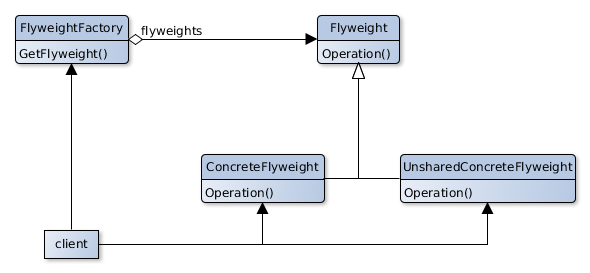

# Flyweight

## Scope
Use the sharing to efficiently support a high number of objects with small granularity.

## Participants
- **Flyweight**
- Declares an interfaces used to receive the state and operate accordingly.
- **ConcreteFlyweight**
   - Implements the Flyweight interface and allows to save an internal state.
   - Since it could be shared its internal state must be independent from the context where he works.
- **UnsharedFlyweight**
   - Flyweight interface does not impose sharing.
   - This type of classes cannot be shared.
- **FlyweightFactory**
   - Creates and manages Flyweight objects.
   - Ensures that the Flyweight objects are shared correctly.
   - When a Client asks for a Flyweight it returns the object or Creates it.
- **Client**
   - Keeps a reference to the FlyweightFactory.
   - Calculates or Stores the external state of the Flyweight objects.

## Collaborations
- The state informations needed by a Flyweight must be divided into internal ones and external ones.
- The internal one is stored by the ConcreteFlyweight, the external one is calculated and stored by the client.
- The Flyweight must be created by the FlyweightFactory to ensure a correct sharing.
