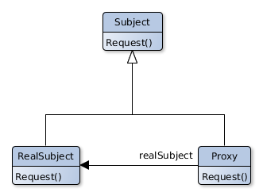

# Proxy

## Scope
Provides a placeholder of another object to manage the access to him.

## Participants
- **Proxy**
   - Keeps a reference to the RealSubject. Subject and RealSubject interfaces must be identical.
   - Provides the same interface as Subject, this allow the Proxy to take the place of the RealSubject.
   - Manages the access to the RealSubject and can create or destroy it.
   - Other responsibilities depending of the type of the proxy:
     - **remote proxies** are responsible for the request encoding ant his delivery to the RealSubject.
     - **virtual proxies** can store additional informations to defer the access to the RealSubject.
     - **protection proxies** check that the client has the needed permissions to make a request to the RealSubject.
- **Subject**
   - Defines a common interface for Proxy and RealSubject.
  - Makes it possible the usage of proxy instead od the RealSubject.
- **RealSubject**
   - Defines the object represented by the proxy.

## Collaborations
- A Proxy transfers the requests to the RealSubject when needed, depending of the type of the proxy used.
